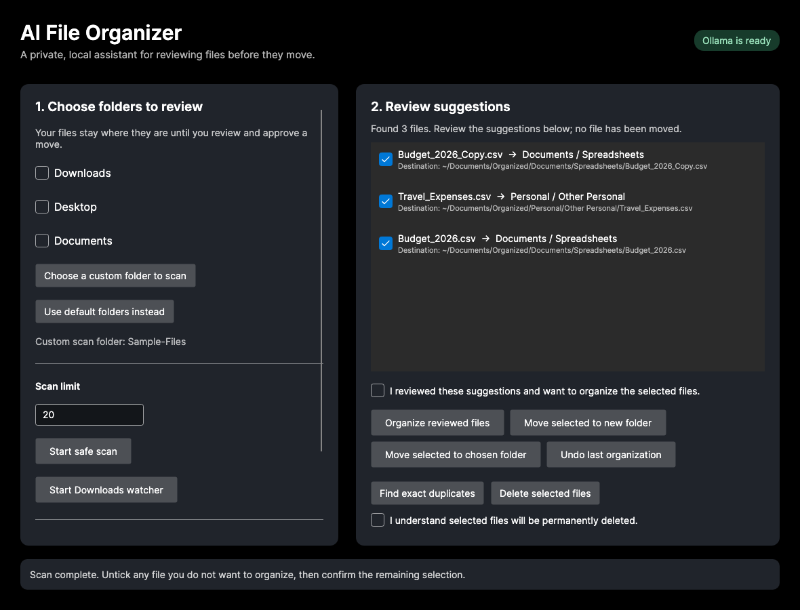

# AI File Organizer

[](https://github.com/NikhilChowdaryBonthu/AIFileOrganizer/actions/workflows/build.yml)

AI File Organizer is a local Mac desktop assistant for reviewing and organizing personal files. It runs on .NET and uses Ollama with `qwen3:4b` on the same Mac for document classification. Files are not uploaded to a cloud AI service.

The app is designed for review first: it scans files, shows a suggested destination for every item, and waits for the user to choose which files to move.



Actual Avalonia app interface rendered with synthetic sample CSV files. No personal files appear in the image, and no files were moved for the screenshot.

## Download and install on Mac

Download [AI File Organizer v2.1.1 for Apple Silicon](https://github.com/NikhilChowdaryBonthu/AIFileOrganizer/releases/download/v2.1.1/AIFileOrganizer-v2.1.1-macos-arm64.zip). Unzip it, move **AI File Organizer.app** to Applications, and open it. The bundle includes the .NET runtime; it still needs [Ollama](https://ollama.com/) running locally with `qwen3:4b` for AI classification (see Requirements below).

The app is ad-hoc signed, not Apple notarized. macOS may display an unidentified-developer warning. Review the [release page](https://github.com/NikhilChowdaryBonthu/AIFileOrganizer/releases/tag/v2.1.1) before opening it; use macOS's Open action only if you trust this project. No account or paid service is needed.

## What the app does

- Scan Downloads, Desktop, Documents, or one custom folder. Selecting a custom folder scans only that folder.
- Enter any scan size from 1 to 1000 files.
- Classify supported files using filename rules, folder context, and local Ollama when needed.
- Keep files visible for review with a filename/context fallback if Ollama is offline or times out.
- Show the full destination path before a file is moved.
- Let the user tick or untick each scanned file.
- Move selected files into the default organized structure, a newly created Documents folder, or any existing folder selected in the app.
- Detect exact duplicate files among the current selected scan results by comparing file contents.
- Detect filename conflicts and keep separate versions safely.
- Send exact duplicate move conflicts to `~/Downloads/Duplicates_Review`.
- Undo the most recent app managed organization batch.
- Watch Downloads while the app is open and add new supported files to review. The watcher never moves files by itself.
- Permanently delete selected files only after a separate deletion confirmation is checked.

## Supported file types

The organizer supports PDFs, Word documents, text files, images, videos, audio files, ZIP/RAR/7Z archives, installers, spreadsheets, and presentations.

## How it works

1. Start Ollama and make sure the `qwen3:4b` model is installed.
2. Open the AI File Organizer app.
3. Choose the folders and the number of files to scan.
4. Review each result and its destination path.
5. Untick files you do not want to change.
6. Choose one action: organize using the suggested category, create a new Documents folder, choose an existing destination folder, find exact duplicates, or permanently delete selected files after the deletion confirmation.
7. Use Undo if you want to restore the latest app managed organization batch.

For a safe first try, create a folder with copies of a few non-sensitive sample files, choose **Choose a custom folder to scan**, and review the suggestions without approving a move. The built-in **Find exact duplicates** action does not change files.

## Privacy and safety

- Classification runs locally through Ollama at `http://localhost:11434`.
- The app does not automatically move files.
- The Downloads watcher only creates review suggestions while the app is open.
- Move history is stored locally in SQLite at `~/Documents/AIFileOrganizer/Database`.
- Undo applies to moves made by the app. Manual Finder changes are not part of app Undo history.
- Permanent deletion cannot be undone by the app. The deletion control requires its own explicit checkbox.

## Requirements

- macOS on Apple Silicon for the packaged app
- Ollama running locally
- The `qwen3:4b` model:

```bash
ollama pull qwen3:4b
```

- .NET 10 SDK only when building or running from source

## Run from source

```bash
dotnet run
```

## Run the safety tests

```bash
dotnet run --project tests/AIFileOrganizer.Tests/AIFileOrganizer.Tests.csproj --configuration Release
```

The tests create isolated temporary files and a separate SQLite history database. They cover moves, filename conflicts, exact duplicates, Undo, and the permanent-deletion confirmation. They do not scan your personal folders.

With Ollama running, an optional live check scans two synthetic text files into an isolated test database:

```bash
dotnet run --project tests/AIFileOrganizer.Tests/AIFileOrganizer.Tests.csproj --configuration Release -- --ai-smoke
```

## Build the standalone Mac app

Create the app bundle with:

```bash
zsh scripts/package-macos.sh
```

This creates `dist/AI File Organizer.app` and verifies its ad-hoc code signature. It includes the .NET runtime, so VS Code and the .NET SDK are not required to open the packaged app. Ollama must still be running for AI based classification.

## Project files

- `Program.cs` contains scanning, classification, organization, duplicate detection, and local history logic.
- `Views/MainWindow.axaml` defines the desktop interface.
- `Views/MainWindow.axaml.cs` connects the buttons and review screen to the organizer logic.
- `scripts/package-macos.sh` builds the Apple Silicon `.app` bundle.
- `tests/AIFileOrganizer.Tests` contains the isolated file-safety checks.

## More documentation

- [Architecture](docs/architecture.md)
- [Changelog](CHANGELOG.md)
- [Demo guide](docs/demo-guide.md)

## Current status

Version 2.1.1 is a local desktop organizer with manual review, custom source and destination folders, duplicate detection, Undo, optional Downloads watching, and standalone Mac app packaging. Text-file classification uses bounded local Ollama requests with structured output and a safe fallback. The app is not Apple notarized.
