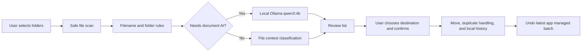

# Architecture

The desktop user interface is built with Avalonia. Core scanning and organization logic is in `Program.cs`. SQLite stores local classification cache and move history. Ollama runs locally and is used only when filename and folder rules are not enough.
